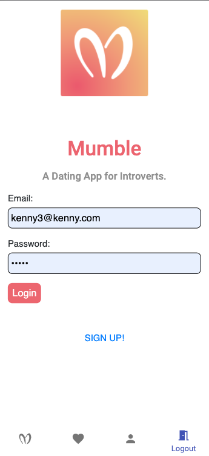

# Mumble

The Dating Application for Introverts.

## Description

An application that matches you and your potential partner based on a complex matching algorithm. A higher 'Love Factor' will result in a better match with your partner, whether that be location, food preference, or simply if they like cats or dogs. There are currently 2,200+ profiles created (most of them aren't real).

## Installation

Use the node package manage (npm) [npm](https://www.npmjs.com/)

```
npm install
```

[Mumble Heroku Deployment](https://mumble-dating-app.herokuapp.com/)

## Visuals

Mumble Discover page


Mumble Login



## Roadmap

- Including a chat section
- Having a mutual likes after having 'liked' someone

## Acknowledgment

- [Bhagyashree](https://github.com/Bhagyashree9402)
- [Jim](https://github.com/jimit1)
- [Louise](https://github.com/llee-125)
- [Meianna](https://github.com/meianna)

## Project Status

Our group created a MVP with simple functions such as the matching algorithm, but would definitely love to add the functions from the Roadmap section of this README.
